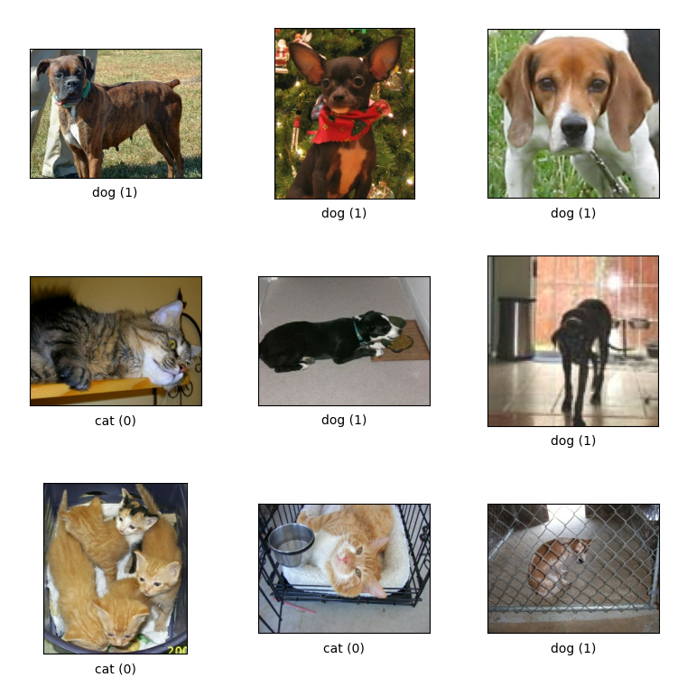

# MobileNet V1 Implementation from scratch

This repository contains the implementation of a MobileNet model from scratch to classify images of cats and dogs using TensorFlow and Keras.

## Repository Structure

- `model.py`: Defines the MobileNet model architecture.
- `train.py`: Handles training and evaluation of the model.
- `test.py`: Loads an image, preprocesses it, and uses the trained model to make predictions.
- `utils.py`: Contains utility functions such as image preprocessing.
- `main.py`: The main script to run the training and testing.

## Setup Instructions

1. **Clone the repository:**
   ```bash
   git clone https://github.com/smhatefi/mobilenet_v1.git
   cd mobilenet_v1

2. **Install the required packages:**
   
   Make sure you have Python and pip installed. Then, install the required Python packages:
   ```bash
   pip install tensorflow keras matplotlib tensorflow-datasets

3. **Download sample images for testing:**

   The `main.py` script downloads sample images for testing.

## How to Run

1. **Train the model and evaluate it:**

   Run the `main.py` script to train and evaluate the model:
   ```
   python main.py
   ```

   This will:
   
   - Train the MobileNet model on the Cats vs. Dogs dataset.
   - Save the trained model to a file `mobilenet_model.h5`.
   - Evaluate the model on the test set and print the test accuracy.
  
   The `main.py` script also includes a test phase that:

   - Loads the trained model.
   - Preprocesses a sample image.
   - Makes a prediction and displays the image with the predicted class label.

2. **Test the model with sample images:**

   Run the `test.py` script to only test the model without training:
   ```
   python test.py
   ```
   This will:
   - Loads the trained model.
   - Preprocesses a sample image.
   - Makes a prediction and displays the image with the predicted class label.

   
   *In this case the model uses the pre-trained weights `mobilenet_model.h5` which i have provided in the repository.*
   

## Utility Functions

`utils.py` contains helper functions for preprocessing images:
- preprocess(image, label): Preprocesses the dataset images (resize and normalize).
- load_and_preprocess_image(image_path): Loads and preprocesses a single image for prediction.


## Dataset

The dataset used for training is the Cats vs. Dogs dataset from TensorFlow Datasets.


## Notes

- The model architecture and training parameters can be adjusted in `model.py` and `train.py` respectively.
- The dataset used is the Cats vs. Dogs dataset available in TensorFlow Datasets. Ensure you have a stable internet connection to download the dataset.

## License

This project is licensed under the MIT License. See the `LICENSE` file for details.

## Acknowledgments

- The MobileNet model architecture is inspired by the original [MobileNet paper](https://arxiv.org/abs/1704.04861).
- To implement the architecture, [this post on Kaggle](https://www.kaggle.com/code/sonukiller99/mobilenet-from-scratch) has been used.
